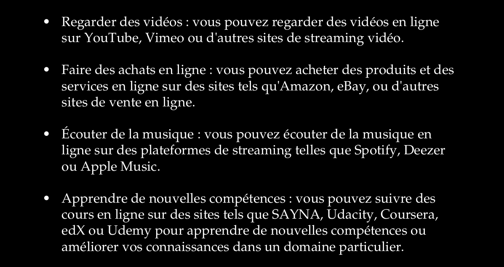

Internet est un réseau mondial de communication qui permet aux ordinateurs et autres appareils électroniques de communiquer entre eux. Le fonctionnement d'Internet est complexe et implique de nombreux composants et protocoles différents, mais voici une vue d'ensemble de son fonctionnement.

Il y a beaucoup de choses que vous pouvez faire en ligne, en voici quelques exemples : 

En résumé, Internet est un réseau mondial de communication qui permet à des millions d'appareils de communiquer entre eux en utilisant un ensemble de protocoles de communication, de routeurs et de serveurs.

